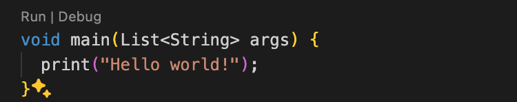
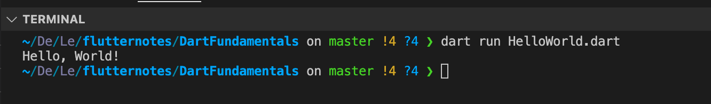

## Ngôn ngữ lập trình Dart

- `Dart` là một ngôn ngữ lập trình được phát triển bởi **Google**. `Dart` khá giống với java nên đa phần các lập trình viên Android chuyển dịch sang làm Flutter khá thuận tiện vì sự giống nhau này.
- Điểm đặt biệt ở dart đó là hỗ trợ biển dịch cả Just in time(JIT) và Ahead of time(AOT) .
  - **Ahead Of Time (AOT):** Với AOT thì trình biên dịch chuyển ngôn ngữ Dart thẳng sang Native Code giúp hiệu năng tốt nhất có thể (tức là khi chạy chương trình, nó sẽ biên dịch từ đầu đến cuối)
  - **Just In Time (JIT):** Còn với JIT cho phép hot reloading hoạt động, giúp phát triển sản phẩm nhanh và tiện dụng hơn (được hiểu như việc debug trong ngôn ngữ khác là debug hàm nào chạy hàm đó thì ở đây nó sẽ viết đến đâu biên dịch ngay đến đấy)

## Cài đặt và chạy Dart trên VSCode

**Bước 1:** Tìm và cài đặt Dart hoặc Flutter từ Extension của VSCode


**Bước 2:** Tạo file `.dart` và ấn nút **run** để chạy

```Dart
  // Khi chương trình được excute, hàm main sẽ được thực thi đầu tiên
  void main() {
    print('Hello, World!');
  }
```



hoặc cũng có thể chạy bằng dòng lệnh 

```bash
dart run HelloWorld.dart
```

