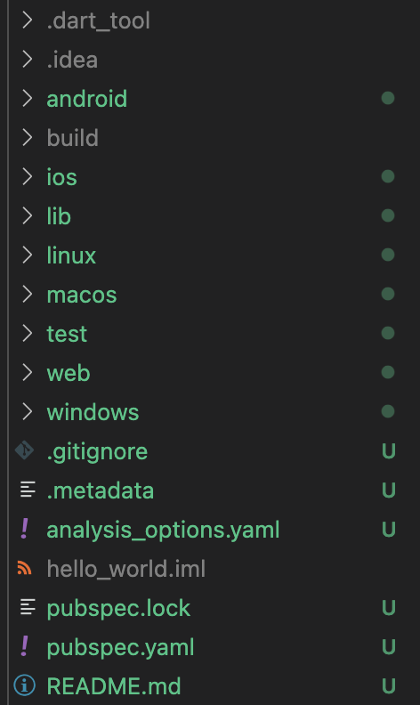
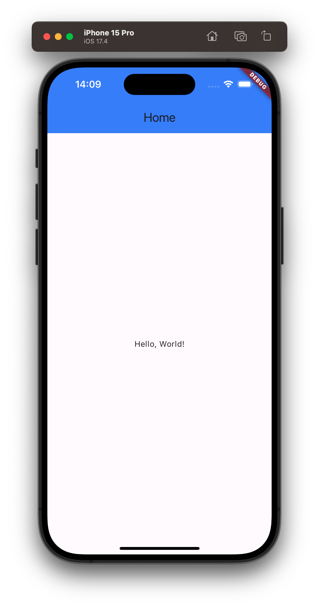
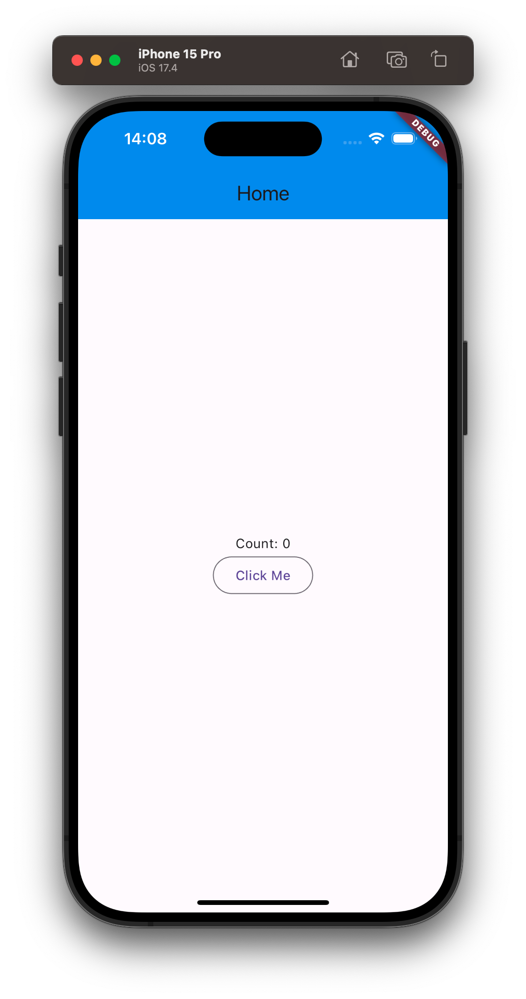

# Một ứng dụng Flutter cơ bản có gì?

## Tạo Project flutter

- Để tạo một project flutter ta dùng lệnh sau

```bash
flutter create --org com.yourdomain your_app_name
```

- Trong đó:
  - `your_app_name` tên ứng dụng của bạn. Lưu ý đặt theo format.
  - `--org com.yourcompany` là `applicationId` (Android) hay `PRODUCT_BUNDLE_IDENTIFIER` (iOS)

- Và để chạy ứng dụng ta dùng lệnh

```bash
flutter run
```

## Cấu trúc dự án

- Sau khi đã tạo được project flutter thì đầu tiên chúng ta cùng tìm hiểu cấu trúc của một dự án flutter



- Trong đó:
  - `android`: Nơi chứa code native của Android
  - `build` sẽ được tạo khi Flutter được thực thi lần đầu tiên. Nó chứa các tệp được tạo cần thiết để chạy ứng dụng trên các nền tảng khác nhau.
  - `ios`: Nơi chứa code native của iOS
  - `lib`: Nơi chứa mã ứng dụng của bạn. Chúng ta sẽ triển khai mã nguồn của dự án tại đây.
  - `test`: Đây là thư mực chứa các file để chúng ta viết các unit-test case.
  - `pubspec.yaml`: Là nơi khai báo các thư viện, config hệ thống.
  - Ngoài ra các bạn còn có thể tạo thêm thư mục trong quá trình phát triển, ví dụ như thư mục **assets** để chứa các file hình ảnh
- Đó là những thư mục và file cơ bản của một project flutter và còn một số thư mục nữa chúng ta sẽ tìm hiểu sau trong quá trình học tập.

## main.dart

- Khi các bạn mở thư mục lib các bạn sẽ thấy một file tên `main.dart` có nội dụng như sau

```Dart
void main() {
  runApp(MyApp());
}

// MyApp()
```
- Đây chính là hàm main và sẽ được chạy đầu tiên trong project.
- Bên trong main gọi hàm `runApp` với đối tượng là `MyApp()` được truyền vào.

## MyApp()

```Dart
class MyApp extends StatelessWidget {
  const MyApp({super.key});

  @override
  Widget build(BuildContext context) {
    return MaterialApp(
      title: 'Flutter Demo',
      theme: ThemeData(
        colorScheme: ColorScheme.fromSeed(seedColor: Colors.deepPurple),
        useMaterial3: true,
      ),
      home: const HomePage(),
    );
  }
}
```

- Trong đó ta thấy `MyApp` kế thừa `StatelessWidget` và ghi đè phương thức `build` trả về `MaterialApp`, là một widget cung cấp cho lập trình viên một bộ khung trong quá trình phát triển ứng dụng như `title`, `theme`, `home`. Mỗi ứng dụng Flutter chỉ nên chứa 1 `MaterialApp`.
- Và trong `MaterialApp` ta lại thấy có `home` với đối tượng là `MyHomePage()`

## StatelessWidget

- Khi màn hình chúng ta không cần thay đổi gì về nội dung (hiển thị tĩnh) thì sẽ kế thừa `StatelessWidget` và khi kế thừa StatelessWidget thì chúng ta phải ghi đè phương thức `build` như ở trên.

```Dart
class HomePage extends StatelessWidget {
  const HomePage({super.key});

  @override
  Widget build(BuildContext context) {
    return Scaffold(
      appBar: AppBar(
        title: const Text('Home'),
        backgroundColor: Colors.blueAccent,
        ),
        body: const Center(
          child: Text('Hello, World!'),
        ),
      );
  }
}
```

- Ở đây chúng ta thấy khi ghi đè build sẽ trả về 1 đối tượng `Scaffold`, là 1 widget cung cấp cho lập trình viên một bộ khung chứa sẵn các thuộc tính quan trong để xây dựng giao diện 1 màn hình như `appBar`, `body`, `FloatingActionButton`,...
- Trong Scaffold ta thấy có khai báo `appBar` với một đối tượng là `AppBar` có thuộc tính title là một `Text` và body được truyền vào 1 widget là `Center` có child widget là `Text`



## StatefulWidget

- Khi bạn tạo page cần thay đổi nội thì sẽ kế thừa `StatefulWidget` và sẽ có một chút thay đổi.
- Khi sử dụng StatefulWidget sẽ có điểm khác là bạn phải khai báo 2 class là `State` và `widget`
- Mục đích của class này là duy trì state khi Flutter re-render các widget

```Dart
class CounterPage extends StatefulWidget {

}

class _CounterPageState extends State<CounterPage> {

}
```

- Ở đây `CounterPage` là **widget** và `_CounterPageState` là **State**
- Sử dụng tiền tố _ của State thì để xem nó là sở hữu riêng của StatefulWidget.

- Khi kế thừa StatefulWidget sẽ cần override `createState` để tạo đối tượng State

```Dart
class CounterPage extends StatefulWidget {
  const CounterPage({Key? key}) : super(key: key);

  @override
  _CounterPageState createState() => _CounterPageState();
}
```

- Còn khi kế thừa State<> thì cần override `build` để tạo các widget

```Dart
class _CounterPageState extends State<CounterPage> {

  var count = 0;

  @override
  Widget build(BuildContext context) {
    return Scaffold(
        appBar: AppBar(
          title: Text("Home"),
          backgroundColor: Colors.blue,
        ),
        body: Center(
          child: Column(
          crossAxisAlignment: CrossAxisAlignment.center,
          mainAxisAlignment: MainAxisAlignment.center,
          children: [
            Text('Count: $count'),
            OutlinedButton(
              onPressed: () {
                setState(() {
                  count++;
                });
              },
              child: const Text('Click Me'),
            )
          ],
        ),)
      );
  }
}
```

- Ở đây đây chúng ta khai báo 1 biến `count = 0` và 1 `Scaffold` có chứa 1 `Column` mà bên trong có 1 `Text` và 1 `OutlinedButton`
- Khi ấn vào nút (`onPressed`) thì chúng ta sẽ gọi hàm `setState()` để set lại giá trị cho biến count = count + 1, có nghĩa là mỗi lần ấn nút thì giá trị count sẽ tăng lên 1.



## Tổng kết
- Tạo một project flutter bằng command line
- Cấu trúc của một dự án Flutter
- Cách sử dụng `StatelessWidget` và `StatefulWidget`

## Nguồn tham khảo
- Bài viết được tham khảo từ các nguồn tài liệu của đồng nghiệp
- Series và Dart và Flutter của [fxstudio](https://fxstudio.dev/category/code/flutter-dart/)
