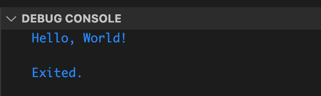
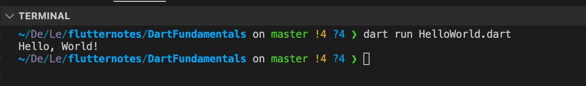

# Setup Flutter SDK MacOS

**1. Cài đặt môi trường cho macOS**

**Bước 1:** Truy cập [Flutter documentation](https://docs.flutter.dev/get-started/install/macos) chọn tab **Download and install** để tải Flutter SDK tương ứng và giải nén vào thư mục bất kì


Bước 2: Cập nhật system cho flutter 

- Chạy lệnh sau để edit `/.zshrc`

```bash
nano $HOME/.zshrc
```

- Thêm dòng dưới và sau đó ấn tổ hợp phím `Ctrl + O` và `Ctrl + X` để thoát

```bash
export PATH=$HOME/path/to/flutter/bin:$PATH
```

- reload lại 

```bash
source .zshrc
```

- Chạy lệnh `flutter -version` để kiểm tra


- Ngoài ra có thể dùng lệnh `flutter doctor` để kiểm tra các yêu cầu cho Fullter


**2. Cài đặt và chạy Dart trên VSCode**
**Bước 1:** Tìm và cài đặt Dart hoặc Flutter từ Extension của VSCode


**Bước 2:** Tạo file `.dart` và ấn nút run để chạy



hoặc cũng có thể chạy bằng dòng lệnh 

```bash
dart run HelloWorld.dart
```

